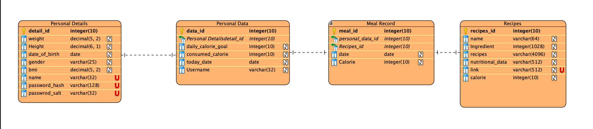
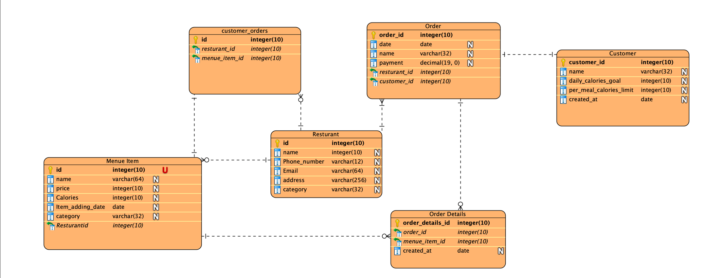

# DB
## Database Documentation

### Overview
This database is structured to hold and manage personal information, dietary details, meal records, and a comprehensive collection of recipes. The design incorporates a separation of personal details from other personal data for enhanced security. The system is capable of tracking daily caloric intake by documenting meal consumption and aggregating total calories consumed per day.

### Security Considerations
Sensitive details such as usernames and passwords are stored in a separate table (`PersonalDetails`) and are protected using hashing and salting techniques. This separation helps to safeguard the data against unauthorized access.

### Functional Operations
The database is set up to track and manage users' daily caloric intake efficiently. When a user logs a meal into the `MealRecord` table, it records their meal along with the corresponding date and recipe. The `consumed_calorie` field in the `PersonalData` table is then updated to reflect the daily total calorie intake.

### Tables Description


## Personal Details
For security reasons, a portion of the user's data is separated from the rest, enhancing the database's level of security. The `PersonalDetails` table stores personal data of the user such as height, weight, and date of birth. Additionally, it manages the security of user accounts by storing the hashed password along with its corresponding salt.
| Field          | Type          | Description                                        |
|----------------|---------------|----------------------------------------------------|
| `detail_id`    | INT       | Primary key. Unique identifier for personal details. |
| `weight`       | DECIMAL(5, 2) | Weight of the individual.                          |
| `Height`       | DECIMAL(6, 1) | Height of the individual.                          |
| `date_of_birth`| DATE          | Individual's birth date.                           |
| `gender`       | VARCHAR(25)   | Gender of the individual.                          |
| `bmi`          | DECIMAL(5, 2) | Body Mass Index of the individual.                 |
| `username`     | VARCHAR(255)  | Username for account login.                        |
| `password_hash`| VARCHAR(128)  | Hashed password for account security.              |
| `password_salt`| VARCHAR(32)   | Salt for the hashed password.                      |

## Personal Data
This table holds information about the user's daily calorie goals and the amount of calories consumed daily. Leveraging database triggers, the `consumed_calorie` field is automatically updated after each meal. When a new record is added to the `MealRecord` table, a trigger updates the consumed calorie total based on the date provided in that table.
#### `PersonalData`
| Field               | Type      | Description                                      |
|---------------------|-----------|--------------------------------------------------|
| `data_id`           | INT   | Primary key. Unique identifier for personal data. |
| `detail_id`         | INT   | Foreign key to `PersonalDetails`.               |
| `daily_calorie_goal`| INT   | Target daily caloric intake.                     |
| `consumed_calorie`  | INT   | Total calories consumed on a given date.         |
| `today_date`        | DATE      | The date for the calorie data.                   |

## Meal Record
The `MealRecord` table stores information about the daily meals consumed by the user. It is used to record data about the meals consumed and categorizes them based on the date of consumption.
| Field            | Type    | Description                                      |
|------------------|---------|--------------------------------------------------|
| meal_id          | INT     | Primary key. Unique identifier for meal records. |
| personal_data_id | INT     | Foreign key to `PersonalData`.                   |
| recipes_id       | INT     | Foreign key to `Recipes`.                        |
| date             | DATE    | Date when the meal was consumed.                 |
| calories         | INT     | Caloric content of the meal.                     |


## Recipes
This table stores all data about the available recipes. It includes comprehensive information about each recipe, along with a link to the original source.

| Field             | Type         | Description                                   |
|-------------------|--------------|-----------------------------------------------|
| recipes_id        | INT          | Primary key. Unique identifier for recipes.   |
| name              | VARCHAR(64)  | Name of the recipe.                           |
| ingredient        | TEXT         | Ingredients used in the recipe.               |
| recipes           | TEXT         | Recipe instructions.                          |
| nutritional_data  | VARCHAR(512) | Nutritional information of the recipe.        |
| link              | VARCHAR(512) | Link to the recipe's source.                  |
| calorie           | INT          | Caloric content of the recipe.                |



## Update Consumed Calories Trigger

The `update_consumed_calories` trigger plays a pivotal role within the database. Its primary function is to automatically update the `consumed_calorie` field in the `PersonalData` table each time a new meal record is inserted into the `MealRecord` table. This trigger is responsible for accurately calculating the total calories consumed by a user for a specific date, by summing up the calories from the meals logged. Its automated nature ensures that users' daily calorie intake is consistently and accurately updated, thereby facilitating efficient and real-time nutritional tracking.
### Script to generate the database
```sql
-- Create a new database (adjust the database name as needed) CREATE DATABASE IF NOT EXISTS FoodDelivery; USE FoodDelivery;

-- Table: Personal Details
 CREATE TABLE IF NOT EXISTS PersonalDetails (
  detail_id INT AUTO_INCREMENT PRIMARY KEY,
  weight DECIMAL(5, 2),
  height DECIMAL(6, 1),
  date_of_birth DATE,
  gender VARCHAR(25),
  bmi DECIMAL(5, 2),
  name VARCHAR(255),
  password_hash VARCHAR(128),
  password_salt VARCHAR(32)
);

-- Table: Personal Data
 CREATE TABLE IF NOT EXISTS PersonalData (
  data_id INT AUTO_INCREMENT PRIMARY KEY,
  detail_id INT,
  daily_calorie_goal INT,
  consumed_calorie INT DEFAULT 0,
  today_date DATE,
  FOREIGN KEY (detail_id) REFERENCES PersonalDetails(detail_id),
  username : varchar(32)
);

-- Table: Recipes 
CREATE TABLE IF NOT EXISTS Recipes (
  recipes_id INT AUTO_INCREMENT PRIMARY KEY,
  name VARCHAR(64),
  ingredient TEXT,
  recipes TEXT,
  nutritional_data varchar(512),
  link VARCHAR(512)
);

-- Table: Meal Record 
CREATE TABLE IF NOT EXISTS MealRecord (
  meal_id INT AUTO_INCREMENT PRIMARY KEY,
  personal_data_id INT,
  Recipes_id INT,
  date DATE,
  calories INT,
  FOREIGN KEY (personal_data_id) REFERENCES PersonalData(data_id),
  FOREIGN KEY (Recipes_id) REFERENCES Recipes(recipes_id)
);

-- Triggers:
The trigger update_consumed_calories automatically updates the consumed_calorie field in the PersonalData table with the total calories consumed for each user on a specific date, immediately after a new meal record is inserted into the MealRecord table.

DELIMITER //

CREATE TRIGGER update_consumed_calories
AFTER INSERT ON MealRecord
FOR EACH ROW
BEGIN

    DECLARE meal_calories INT;


    SELECT calorie INTO meal_calories
    FROM Recipes
    WHERE recipes_id = NEW.Recipes_id;


    UPDATE PersonalData
    SET consumed_calorie = consumed_calorie + meal_calories
    WHERE personaldata.data_id = NEW.personal_data_id
    AND today_date = NEW.date;
END;

//
DELIMITER ;


```


# DataBase for Food Delivery part, based on SQL Alchemy

## Overview

This database is designed to store and manage data related to restaurant menu items and customer orders. It provides a structured way to keep track of what items are available on the menu, details about each restaurant, orders placed by customers, and the specifics of each order. The database schema facilitates the connection between different entities such as menu items, restaurants, orders, and customers, ensuring an integrated data management system.
##### Calorie Tracking in the App's Food Delivery Section
The food delivery section of the app also stores information about the caloric content of each menu item. In simpler terms, it records the amount of calories in the ordered foods and also stores the date of the order. This feature allows users to keep track of the amount of calories they consume on a daily basis, aligning with dietary tracking and health management goals.


## Tables Description

### `Restaurant`

Stores essential information about restaurants, such as their unique identifier, name, contact phone number, and email address.

| Column Name   | Data Type | Description                           |
|---------------|-----------|---------------------------------------|
| id            | INT       | Primary key, auto-incremented         |
| name          | VARCHAR   | Name of the restaurant                |
| Phone_number  | VARCHAR   | Contact phone number for the restaurant |
| Email         | VARCHAR   | Contact email address for the restaurant |

### `Menu_Item`

Holds detailed information about the menu items available in each restaurant, including the item's unique identifier, name, price, and caloric content.

| Column Name      | Data Type | Description                                 |
|------------------|-----------|---------------------------------------------|
| id               | INT       | Primary key, auto-incremented               |
| name             | VARCHAR   | Name of the menu item                       |
| price            | INT       | Price of the menu item                      |
| Calories         | INT       | Caloric content of the menu item            |
| Item_adding_date | DATE      | Date when the item was added to the menu    |
| Restaurant_id    | INT       | Foreign key to `Restaurant` table           |

### `Order`

Records details of customer orders, capturing the unique identifier of the order, the date it was placed, and the associated restaurant.

| Column Name   | Data Type | Description                        |
|---------------|-----------|------------------------------------|
| order_id      | INT       | Primary key, auto-incremented      |
| date          | DATE      | The date when the order was placed |
| restaurant_id | INT       | Foreign key to `Restaurant` table  |

### `Order_Details`

Provides a detailed breakdown of each order, linking orders to the menu items included in them.

| Column Name       | Data Type | Description                             |
|-------------------|-----------|-----------------------------------------|
| order_details_id  | INT       | Primary key, auto-incremented           |
| order_id          | INT       | Foreign key to `Order` table            |
| menu_item_id      | INT       | Foreign key to `Menu_Item` table        |

### `Customer_Orders`

Creates a direct link between restaurants and the menu items ordered by customers, vital for understanding customer preferences.

| Column Name     | Data Type | Description                                 |
|-----------------|-----------|---------------------------------------------|
| id              | INT       | Primary key, auto-incremented               |
| restaurant_id   | INT       | Foreign key to `Restaurant` table           |
| menu_item_id    | INT       | Foreign key to `Menu_Item` table            |


### Script to generate it on the SQL

```
CREATE TABLE IF NOT EXISTS `Menu_Item` (
  `id` INT NOT NULL AUTO_INCREMENT,
  `name` VARCHAR(64) NOT NULL,
  `price` INT NOT NULL,
  `Calories` INT NOT NULL,
  `Item_adding_date` DATE NOT NULL,
  `Restaurant_id` INT NOT NULL,
  PRIMARY KEY (`id`)
);

CREATE TABLE IF NOT EXISTS `Restaurant` (
  `id` INT NOT NULL AUTO_INCREMENT,
  `name` VARCHAR(64) NOT NULL,
  `Phone_number` VARCHAR(12) NOT NULL,
  `Email` VARCHAR(64) NOT NULL,
  PRIMARY KEY (`id`)
);

CREATE TABLE IF NOT EXISTS `Order` (
  `order_id` INT NOT NULL AUTO_INCREMENT,
  `date` DATE NOT NULL,
  `restaurant_id` INT NOT NULL,
  PRIMARY KEY (`order_id`)
);

CREATE TABLE IF NOT EXISTS `Order_Details` (
  `order_details_id` INT NOT NULL AUTO_INCREMENT,
  `order_id` INT NOT NULL,
  `menu_item_id` INT NOT NULL,
  PRIMARY KEY (`order_details_id`)
);

CREATE TABLE IF NOT EXISTS `customer_orders` (
  `id` INT NOT NULL AUTO_INCREMENT,
  `restaurant_id` INT NOT NULL,
  `menu_item_id` INT NOT NULL,
  PRIMARY KEY (`id`)
);

-- Add Foreign Keys
ALTER TABLE `Menu_Item` ADD CONSTRAINT `fk_Menu_Item_Restaurant` FOREIGN KEY (`Restaurant_id`) REFERENCES `Restaurant` (`id`);
ALTER TABLE `Order` ADD CONSTRAINT `fk_Order_Restaurant` FOREIGN KEY (`restaurant_id`) REFERENCES `Restaurant` (`id`);
ALTER TABLE `Order_Details` ADD CONSTRAINT `fk_Order_Details_Order` FOREIGN KEY (`order_id`) REFERENCES `Order` (`order_id`);
ALTER TABLE `Order_Details` ADD CONSTRAINT `fk_Order_Details_Menu_Item` FOREIGN KEY (`menu_item_id`) REFERENCES `Menu_Item` (`id`);
ALTER TABLE `customer_orders` ADD CONSTRAINT `fk_customer_orders_Restaurant` FOREIGN KEY (`restaurant_id`) REFERENCES `Restaurant` (`id`);
ALTER TABLE `customer_orders` ADD CONSTRAINT `fk_customer_orders_Menu_Item` FOREIGN KEY (`menu_item_id`) REFERENCES `Menu_Item` (`id`);

```

### The script to generate The database on SQL Alchemy

```
from sqlalchemy import create_engine, Column, Integer, String, Date, ForeignKey
from sqlalchemy.ext.declarative import declarative_base
from sqlalchemy.orm import relationship

Base = declarative_base()

class MenuItem(Base):
    __tablename__ = 'Menu_Item'
    id = Column(Integer, primary_key=True, autoincrement=True)
    name = Column(String(64), nullable=False)
    price = Column(Integer, nullable=False)
    Calories = Column(Integer, nullable=False)
    Item_adding_date = Column(Date, nullable=False)
    Restaurant_id = Column(Integer, ForeignKey('Restaurant.id'))
    restaurant = relationship("Restaurant", back_populates="menu_items")

class Restaurant(Base):
    __tablename__ = 'Restaurant'
    id = Column(Integer, primary_key=True, autoincrement=True)
    name = Column(String(64), nullable=False)
    Phone_number = Column(String(12), nullable=False)
    Email = Column(String(64), nullable=False)
    menu_items = relationship("MenuItem", order_by=MenuItem.id, back_populates="restaurant")
    orders = relationship("Order", back_populates="restaurant")

class Order(Base):
    __tablename__ = 'Order'
    order_id = Column(Integer, primary_key=True, autoincrement=True)
    date = Column(Date, nullable=False)
    restaurant_id = Column(Integer, ForeignKey('Restaurant.id'))
    restaurant = relationship("Restaurant", back_populates="orders")
    order_details = relationship("OrderDetails", back_populates="order")

class OrderDetails(Base):
    __tablename__ = 'Order_Details'
    order_details_id = Column(Integer, primary_key=True, autoincrement=True)
    order_id = Column(Integer, ForeignKey('Order.order_id'))
    menu_item_id = Column(Integer, ForeignKey('Menu_Item.id'))
    order = relationship("Order", back_populates="order_details")
    menu_item = relationship("MenuItem")

class CustomerOrders(Base):
    __tablename__ = 'customer_orders'
    id = Column(Integer, primary_key=True, autoincrement=True)
    restaurant_id = Column(Integer, ForeignKey('Restaurant.id'))
    menu_item_id = Column(Integer, ForeignKey('Menu_Item.id'))
    restaurant = relationship("Restaurant")
    menu_item = relationship("MenuItem")

# Create an engine that stores data in the local directory's
# sqlalchemy_example.db file.
engine = create_engine('sqlite:///sqlalchemy_example.db')

# Create all tables in the engine. This is equivalent to "Create Table"
# statements in raw SQL.
Base.metadata.create_all(engine)

```
## Why Using SQL Server and SQL Alchemy

In this project, to increase the learning curve, the team decided to utilize two distinct databases: Microsoft SQL Server and SQL Alchemy. The role of SQL Alchemy was for both database creation based on Python and also acting as an API to facilitate the communication between SQL Server and the database for the calorie tracking part of the application.

## Conclusion

To conclude, the application benefits from two parallel databases serving distinct purposes. One database tracks all recipes and personal information of the user, while the other stores data about restaurants and the amount of calories the user consumes from restaurant foods. Besides calorie tracking, the application offers a multitude of recipes for the same food by distinct chefs, serving as a helpful tool for saving time in today's busy contemporary life.
